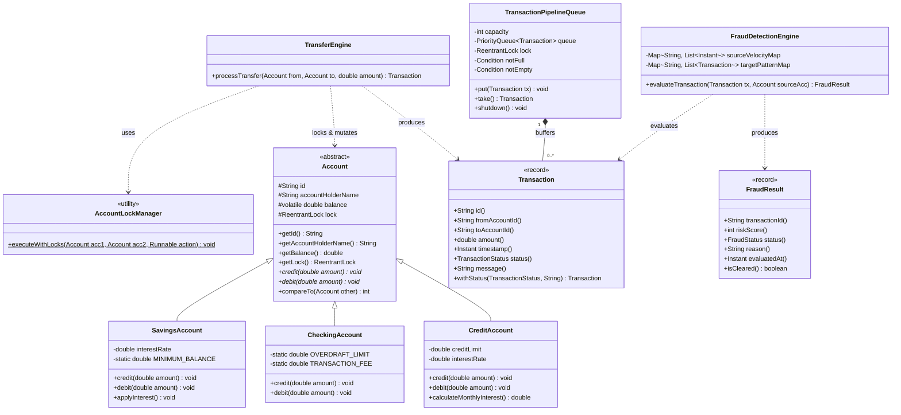

# INITIAL ARCHITECTURAL CLASS DIAGRAM (UML v1.0)

**Project:** Automated Banking & Fraud Detection System  
**Phase:** Phase 1 & 2 Core Class Structure (Day 5 Milestone)  
**Assigned Commit Owner:** Hamza Zahoor (Commit C05)  

---

## 1. Class Diagram Overview

---

## 2. Key Architecture Relationships Highlighted

1. **Polymorphic Inheritance:** `SavingsAccount`, `CheckingAccount`, and `CreditAccount` extend the abstract `Account` base class, implementing specialized `debit()` balance protection rules.
2. **Lock Order Coupling:** `AccountLockManager` enforces total lock ordering on pairs of `Account` locks prior to execution inside `TransferEngine`.
3. **Producer-Consumer Handoff:** `TransactionPipelineQueue` holds buffered `Transaction` records awaiting `FraudDetectionEngine` analysis.
