# Evolved System Architecture Class Diagram (UML v2.0)

**Project:** Automated High-Throughput Banking & Real-Time Fraud Detection Engine  
**Author:** Muhammad Arslan (`arslan2147c@gmail.com`)  
**Version:** 2.0 (Final Release)  

---

## 1. Class Diagram Overview

```mermaid
classDiagram
    %% Core Domain Models
    class Account {
        <<abstract>>
        -String id
        -String ownerName
        -double balance
        -ReentrantLock lock
        +getId() String
        +getOwnerName() String
        +getBalance() double
        +getLock() ReentrantLock
        +credit(amount) void
        +debit(amount)* void
        +compareTo(other) int
    }

    class SavingsAccount {
        -double interestRate
        -double minimumBalance
        +debit(amount) void
        +applyMonthlyInterest() void
    }

    class CheckingAccount {
        -double overdraftLimit
        -double transactionFee
        +debit(amount) void
    }

    class CreditAccount {
        -double creditLimit
        -double apr
        +debit(amount) void
        +getAvailableCredit() double
    }

    class Transaction {
        <<record>>
        +String transactionId
        +String fromAccountId
        +String toAccountId
        +double amount
        +Instant timestamp
        +TransactionStatus status
        +String statusDetails
        +createNew(from, to, amt)$ Transaction
        +withStatus(status, details) Transaction
    }

    class FraudResult {
        <<record>>
        +String transactionId
        +FraudStatus status
        +String ruleTriggered
        +double riskScore
        +Instant timestamp
        +cleared(txId)$ FraudResult
        +flagged(txId, rule, score)$ FraudResult
        +quarantined(txId, rule, score)$ FraudResult
    }

    Account <|-- SavingsAccount
    Account <|-- CheckingAccount
    Account <|-- CreditAccount

    %% Concurrency & Execution Engine Layer
    class AccountLockManager {
        -Map~String, ReentrantLock~ lockRegistry
        +acquireLocks(acc1, acc2) LockPair
        +releaseLocks(lockPair) void
    }

    class TransferEngine {
        -AccountLockManager lockManager
        +processTransfer(fromAcc, toAcc, amount) Transaction
    }

    class TransactionPipelineQueue {
        -PriorityBlockingQueue~PrioritizedTransaction~ queue
        -int capacity
        +put(transaction, priority) void
        +take() Transaction
        +size() int
    }

    class FraudDetectionEngine {
        -Map~String, List~Transaction~~ accountHistory
        -double largeAmountThreshold
        -int velocityLimit
        +evaluateTransaction(tx, account) FraudResult
        +resetWindowHistory() void
    }

    class LockStrategy {
        <<interface>>
        +executeWithLocks(acc1, acc2, task)* void
    }

    class SafeLockStrategy {
        +executeWithLocks(acc1, acc2, task) void
    }

    class DeadlockProneLockStrategy {
        -long sleepDelayMs
        +executeWithLocks(acc1, acc2, task) void
    }

    class TimedLockStrategy {
        -long timeoutMs
        +executeWithLocks(acc1, acc2, task) void
    }

    LockStrategy <|.. SafeLockStrategy
    LockStrategy <|.. DeadlockProneLockStrategy
    LockStrategy <|.. TimedLockStrategy

    TransferEngine --> AccountLockManager
    TransferEngine --> Transaction
    TransactionPipelineQueue --> Transaction
    FraudDetectionEngine --> Transaction
    FraudDetectionEngine --> FraudResult

    %% User Interface Layer
    class MainApp {
        +start(Stage stage) void
        +stop() void
    }

    class DashboardController {
        -Map~String, Account~ accountMap
        -TransferEngine transferEngine
        -FraudDetectionEngine fraudEngine
        -TransactionPipelineQueue pipelineQueue
        -ExecutorService workerThreadPool
        +initialize(location, resources) void
        +handleExecuteTransfer() void
        +handleInjectTraffic() void
        +handleTriggerDeadlock() void
        +handleResetSystem() void
    }

    class JavaFXEventListener {
        <<interface>>
        +onTransactionProcessed(tx, result)* void
        +onAccountBalanceChanged(acc)* void
        +onDeadlockDetected(details)* void
    }

    class JavaFXEventBridge {
        +publishTransactionEvent(listener, tx, result)$ void
        +publishAccountEvent(listener, acc)$ void
        +publishDeadlockEvent(listener, details)$ void
    }

    class TelemetryViewController {
        -AtomicInteger totalProcessed
        -AtomicInteger flaggedCount
        -AtomicInteger quarantinedCount
        -ConcurrentLinkedQueue~Long~ timestampQueue
        +calculateCurrentTps(windowMs) double
        +calculateCompositeRiskScore() double
        +getThreatLevelBadge() String
    }

    JavaFXEventListener <|.. DashboardController
    JavaFXEventListener <|.. TelemetryViewController
    DashboardController --> JavaFXEventBridge
    DashboardController --> TransferEngine
    DashboardController --> FraudDetectionEngine

    %% Persistence Layer
    class LedgerFileManager {
        +exportAccountsToCsv(accounts, targetFile)$ void
        +importAccountsFromCsv(sourceFile)$ List~Account~
        +exportTransactionsToJson(transactions, targetFile)$ void
    }

    class BinaryStateSerializer {
        +saveSnapshot(snapshot, targetFile)$ void
        +loadSnapshot(sourceFile)$ EngineSnapshot
    }

    class EngineSnapshot {
        <<record>>
        +long snapshotTimestamp
        +List~Account~ accountSnapshots
        +List~Transaction~ transactionHistory
        +Map~String, String~ systemMetadata
    }

    BinaryStateSerializer --> EngineSnapshot
    EngineSnapshot --> Account
    EngineSnapshot --> Transaction
```

---

## 2. Layer Relationships & Architectural Guarantees

1. **Domain Abstraction:** `Account` provides abstract contract for polymorphic subclasses (`SavingsAccount`, `CheckingAccount`, `CreditAccount`).
2. **Concurrency Safety:** `AccountLockManager` orders locks deterministically by Account ID (`compareTo`), completely preventing Coffman's Circular Wait condition.
3. **Thread Handoff:** Engine events pass from background threads to JavaFX UI thread via `JavaFXEventBridge.publish*()` using `Platform.runLater()`.
4. **State Persistence:** `BinaryStateSerializer` saves/restores complete `EngineSnapshot` instances with custom `readObject` lock re-initialization.
