# Evolved System Architecture Class Diagram (UML v2.0)

**Project:** Automated High-Throughput Banking & Real-Time Fraud Detection Engine  
**Author:** Muhammad Arslan (`arslan2147c@gmail.com`)  
**Version:** 2.0 (Final Post-Remediation Release)  

---

## 1. Class Diagram Overview

```mermaid
classDiagram
    %% Core Domain Models
    class Comparable~T~ {
        <<interface>>
        +compareTo(other)* int
    }

    class Serializable {
        <<interface>>
    }

    class Account {
        <<abstract>>
        -String id
        -String ownerName
        -double balance
        -ReentrantLock lock
        +getId() String
        +getOwnerName() String
        +getBalance() double
        +getNetPosition() double
        +getLock() ReentrantLock
        +credit(amount) void
        +debit(amount)* void
        +feeFor(amount) double
        +setBalanceDirectly(newBalance) void
        +compareTo(other) int
        -readObject(in) void
    }

    class SavingsAccount {
        -double interestRate
        -double minimumBalance
        +debit(amount) void
        +applyInterest() void
        +applyMonthlyInterest() void
    }

    class CheckingAccount {
        -double overdraftLimit
        -double transactionFee
        +debit(amount) void
        +feeFor(amount) double
    }

    class CreditAccount {
        -double creditLimit
        -double apr
        +debit(amount) void
        +credit(amount) void
        +getNetPosition() double
        +getAvailableCredit() double
    }

    class Transaction {
        <<record>>
        +String transactionId
        +String fromAccountId
        +String toAccountId
        +double amount
        +Instant timestamp
        +TransactionStatus status
        +String statusDetails
        +createNew(from, to, amt)$ Transaction
        +withStatus(status, details) Transaction
    }

    class TransactionStatus {
        <<enumeration>>
        COMPLETED
        FAILED_INSUFFICIENT_FUNDS
        FAILED_INVALID_ACCOUNT
        FLAGGED_SUSPICIOUS
        FLAGGED_FRAUD
        CANCELLED
    }

    class FraudResult {
        <<record>>
        +String transactionId
        +FraudStatus status
        +String ruleTriggered
        +double riskScore
        +Instant timestamp
        +cleared(txId)$ FraudResult
        +flagged(txId, rule, score)$ FraudResult
    }

    class FraudStatus {
        <<enumeration>>
        CLEARED
        FLAGGED_SUSPICIOUS
        QUARANTINED
    }

    Comparable <|.. Account
    Serializable <|.. Account
    Account <|-- SavingsAccount
    Account <|-- CheckingAccount
    Account <|-- CreditAccount
    Transaction ..> TransactionStatus
    FraudResult ..> FraudStatus

    %% Concurrency & Execution Engine Layer
    class AccountLockManager {
        <<utility>>
        +executeWithLocks(action, accounts...)$ void
        +executeWithLocks(acc1, acc2, action)$ void
    }

    class TransferEngine {
        +processTransfer(fromAcc, toAcc, amount) Transaction
        +processTransfer(fromAcc, toAcc, amount, strategy) Transaction
        +processTransfer(fromAcc, toAcc, feeAcc, amount) Transaction
        +processTransfer(fromAcc, toAcc, feeAcc, amount, strategy) Transaction
    }

    class SettlementService {
        -TransferEngine transferEngine
        -FraudDetectionEngine fraudEngine
        +settle(from, to, amount, strategy) SettlementOutcome
        +settle(from, to, feeAcc, amount, strategy) SettlementOutcome
    }

    class SettlementOutcome {
        <<record>>
        +Transaction transaction
        +FraudResult fraudResult
    }

    class TransactionPipelineQueue {
        -int capacity
        -PriorityQueue~Transaction~ queue
        -ReentrantLock lock
        -Condition notFull
        -Condition notEmpty
        -AtomicLong totalEnqueued
        -AtomicLong totalDequeued
        -boolean shutdown
        +put(tx) void
        +offer(tx, timeout, unit) boolean
        +take() Transaction
        +poll(timeout, unit) Transaction
        +shutdown() void
        +size() int
    }

    class PipelineCoordinator {
        -TransactionPipelineQueue pipelineQueue
        -SettlementService settlementService
        -ExecutorService consumerPool
        -List~JavaFXEventListener~ listeners
        +submitTransaction(tx, timeout, unit) boolean
        +shutdown() void
    }

    class FraudDetectionEngine {
        +double LARGE_AMOUNT_THRESHOLD$
        +int VELOCITY_COUNT_THRESHOLD$
        +Duration VELOCITY_WINDOW$
        +int SUSPICIOUS_SOURCES_THRESHOLD$
        +double RAPID_DRAIN_RATIO_THRESHOLD$
        -Map~String, Deque~Instant~~ sourceVelocityMap
        -Map~String, Deque~Transaction~~ targetPatternMap
        +evaluateTransaction(tx, account) FraudResult
        +evaluateTransaction(tx, account, preBalance) FraudResult
        +pruneExpiredWindows(now) void
        +resetWindowHistory() void
    }

    class LockStrategy {
        <<interface>>
        +executeWithLocks(acc1, acc2, action)* void
        +getStrategyName()* String
    }

    class StrategyChoice {
        <<enumeration>>
        SAFE
        NAIVE
        TIMED
    }

    class SafeLockStrategy {
        +executeWithLocks(acc1, acc2, action) void
        +getStrategyName() String
    }

    class DeadlockProneLockStrategy {
        -long artificialDelayMs
        +executeWithLocks(acc1, acc2, action) void
        +getStrategyName() String
    }

    class TimedLockStrategy {
        -long timeoutMs
        -int maxRetries
        +executeWithLocks(acc1, acc2, action) void
        +getStrategyName() String
    }

    LockStrategy <|.. SafeLockStrategy
    LockStrategy <|.. DeadlockProneLockStrategy
    LockStrategy <|.. TimedLockStrategy
    LockStrategy ..> StrategyChoice

    TransferEngine ..> AccountLockManager
    SettlementService --> TransferEngine
    SettlementService --> FraudDetectionEngine
    SettlementService ..> SettlementOutcome
    PipelineCoordinator --> TransactionPipelineQueue
    PipelineCoordinator --> SettlementService
    FraudDetectionEngine ..> FraudResult

    %% User Interface Layer
    class MainApp {
        -DashboardController controller
        +start(stage) void
        +stop() void
    }

    class DashboardController {
        -Map~String, Account~ accountMap
        -TransferEngine transferEngine
        -FraudDetectionEngine fraudEngine
        -SettlementService settlementService
        -PipelineCoordinator pipelineCoordinator
        -TelemetryViewController telemetryController
        -ThreadPoolExecutor workerThreadPool
        +initialize(location, resources) void
        +shutdown() void
    }

    class JavaFXEventListener {
        <<interface>>
        +onTransactionProcessed(tx, result)* void
        +onAccountBalanceChanged(acc)* void
        +onDeadlockDetected(details)* void
    }

    class JavaFXEventBridge {
        +publishTransactionEvent(listener, tx, result)$ void
        +publishAccountEvent(listener, acc)$ void
        +publishDeadlockEvent(listener, details)$ void
    }

    class TelemetryViewController {
        -AtomicInteger totalTransactionsProcessed
        -AtomicInteger flaggedCount
        -AtomicInteger quarantinedCount
        -ConcurrentLinkedQueue~Long~ timestampQueue
        -List~String~ quarantineLogStream
        +calculateCurrentTps(windowMs) double
        +calculateCompositeRiskScore() double
        +getThreatLevelBadge() String
    }

    JavaFXEventListener <|.. DashboardController
    JavaFXEventListener <|.. TelemetryViewController
    JavaFXEventListener *-- JavaFXEventBridge
    MainApp --> DashboardController
    DashboardController ..|> JavaFXEventListener
    PipelineCoordinator --> JavaFXEventListener

    %% Persistence Layer
    class LedgerFileManager {
        <<utility>>
        +exportAccountsToCsv(accounts, targetFile)$ void
        +importAccountsFromCsv(sourceFile)$ List~Account~
        +exportTransactionsToJson(transactions, targetFile)$ void
    }

    class BinaryStateSerializer {
        <<utility>>
        +saveSnapshot(snapshot, targetFile)$ void
        +loadSnapshot(sourceFile)$ EngineSnapshot
    }

    class EngineSnapshot {
        <<record>>
        +long snapshotTimestamp
        +List~Account~ accountSnapshots
        +List~Transaction~ transactionHistory
        +Map~String, String~ systemMetadata
    }

    BinaryStateSerializer *-- EngineSnapshot
    EngineSnapshot --> Account
    EngineSnapshot --> Transaction
```

---

## 2. Architectural Guarantees & Refactored Principles

1. **Polymorphic Net Position Accounting:** `Account.getNetPosition()` returns signed liquidity contribution (Asset balance positive, Credit liability balance negative).
2. **Deterministic N-Account Lock Ordering:** `AccountLockManager.executeWithLocks()` sorts accounts lexicographically by Account ID (`compareTo`), breaking Coffman's Circular Wait condition for arbitrary N accounts.
3. **Pre-Execution Fraud Pipeline:** `SettlementService` evaluates `FraudDetectionEngine` against pre-transfer balance *before* balance mutation, blocking `QUARANTINED` transfers ($\ge 70$ risk score).
4. **Active Bounded Backpressure:** `TransactionPipelineQueue` buffers up to 100 transactions using dual `Condition` variables (`notFull`, `notEmpty`) and 3 background consumer threads in `PipelineCoordinator`.
5. **Recoverable Deadlock Demonstration:** Deadlock demo operates on isolated `DEMO-A`/`DEMO-B` accounts using `lockInterruptibly()`. An 800ms JMX watchdog detects deadlocks via `ThreadMXBean` and breaks them via `interrupt()`.
